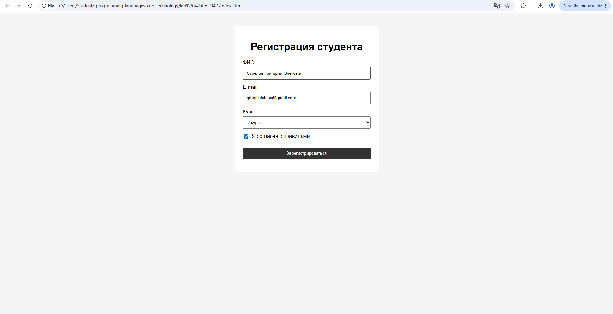
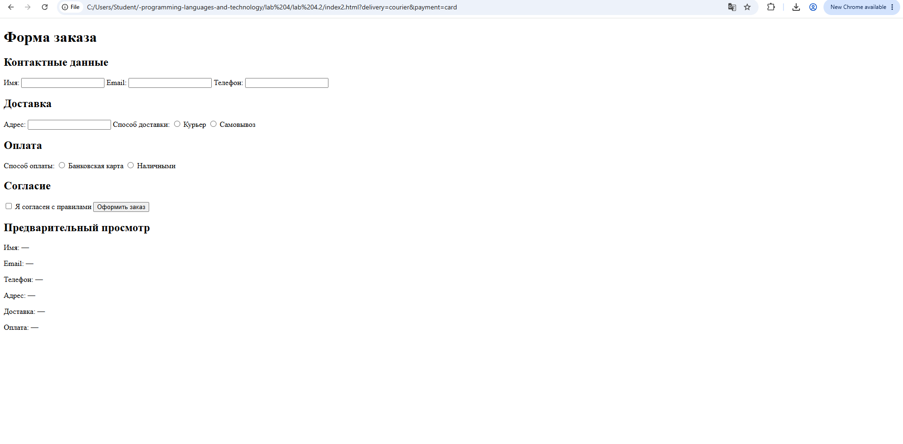
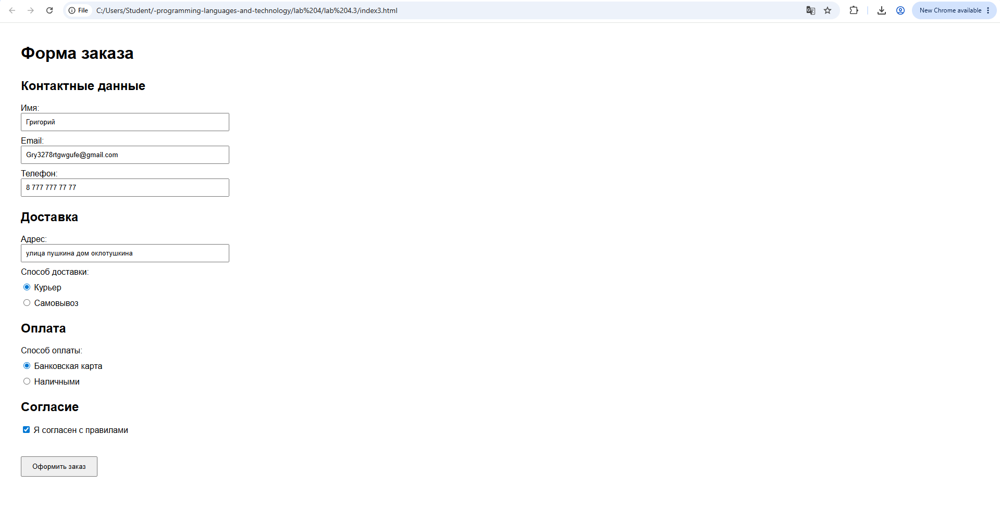

10. Тема и цель работы
Тема: Создание и валидация многоэлементной формы интернет-магазина.

Цель работы: изучить создание HTML-форм, научиться использовать различные элементы формы, выполнять проверку введённых данных с помощью JavaScript и добавлять интерактивность на веб-страницу.

11. Номер и условие варианта
Вариант: 1, 8, 16.

Условие задания:

Творческое дополнительное задание: добавить интерактивность, которой нет в основном варианте. Возможные варианты: счётчик символов, динамическое появление дополнительного поля, подсветка корректных и ошибочных значений, предварительный просмотр введённых данных или расчёт стоимости.

В работе реализован предварительный просмотр введённых данных.

12. Краткое описание элементов формы и правил валидации
В работе создана форма заказа товара интернет-магазина.

Форма содержит следующие элементы:

поле для ввода имени;

поле для ввода электронной почты;

поле для ввода телефона;

поле для ввода адреса;

переключатель способа доставки;

переключатель способа оплаты;

флажок согласия с правилами;

кнопку оформления заказа.

Для проверки данных используется JavaScript.

При отправке формы проверяется:

Заполнено ли поле имени.

Заполнено ли поле электронной почты.

Заполнено ли поле телефона.

Заполнено ли поле адреса.

Выбран ли способ доставки.

Выбран ли способ оплаты.

Установлен ли флажок согласия с правилами.

Если какое-либо обязательное поле не заполнено, рядом с ним выводится сообщение об ошибке.

Если все поля заполнены правильно, появляется сообщение:

«Заказ успешно оформлен!»

В качестве дополнительной интерактивности реализован предварительный просмотр. При вводе имени, электронной почты, телефона и адреса информация автоматически отображается в отдельном блоке. Выбранный способ доставки и оплаты также отображается в предварительном просмотре.

13. Исходный код HTML, CSS и JavaScript
HTML
<!DOCTYPE html>
<html lang="ru">
<head>
    <meta charset="UTF-8">
    <title>Заказ товара</title>
    <link rel="stylesheet" href="style.css">
</head>

<body>

<h1>Форма заказа</h1>

<form id="orderForm">

    <h2>Контактные данные</h2>

    <label>Имя:</label>
    <input type="text" id="name">
    

    <label>Email:</label>
    <input type="email" id="email">
    

    <label>Телефон:</label>
    <input type="text" id="phone">
    

    <h2>Доставка</h2>

    <label>Адрес:</label>
    <input type="text" id="address">
    

    <label>Способ доставки:</label>

    <label>
        <input type="radio" name="delivery" value="courier">
        Курьер
    </label>

    <label>
        <input type="radio" name="delivery" value="pickup">
        Самовывоз
    </label>

    

    <h2>Оплата</h2>

    <label>Способ оплаты:</label>

    <label>
        <input type="radio" name="payment" value="card">
        Банковская карта
    </label>

    <label>
        <input type="radio" name="payment" value="cash">
        Наличными
    </label>

    

    <h2>Согласие</h2>

    <label>
        <input type="checkbox" id="agreement">
        Я согласен с правилами
    </label>

    

    <button type="submit">Оформить заказ</button>

</form>

    <h2>Предварительный просмотр</h2>

    
Имя: —

    
Email: —

    
Телефон: —

    
Адрес: —

    
Доставка: —

    
Оплата: —

</body>
</html>

CSS
body {
    font-family: Arial;
    margin: 40px;
}

form {
    width: 400px;
}

h1 {
    margin-bottom: 30px;
}

h2 {
    margin-top: 25px;
}

label {
    display: block;
    margin-top: 10px;
}

input[type="text"],
input[type="email"] {
    width: 100%;
    padding: 8px;
    box-sizing: border-box;
}

span {
    display: block;
    color: red;
    font-size: 14px;
    margin-top: 3px;
}

button {
    margin-top: 20px;
    padding: 10px 20px;
}

#preview {
    width: 400px;
    margin-top: 30px;
    padding: 15px;
    border: 1px solid #ccc;
}

#preview span {
    display: inline;
    color: black;
    font-size: 16px;
}

#success {
    color: green;
}

JavaScript
const form = document.getElementById("orderForm");

const nameInput = document.getElementById("name");
const emailInput = document.getElementById("email");
const phoneInput = document.getElementById("phone");
const addressInput = document.getElementById("address");

nameInput.addEventListener("input", function() {
    document.getElementById("previewName").textContent =
        nameInput.value || "—";
});

emailInput.addEventListener("input", function() {
    document.getElementById("previewEmail").textContent =
        emailInput.value || "—";
});

phoneInput.addEventListener("input", function() {
    document.getElementById("previewPhone").textContent =
        phoneInput.value || "—";
});

addressInput.addEventListener("input", function() {
    document.getElementById("previewAddress").textContent =
        addressInput.value || "—";
});

const deliveryInputs = document.querySelectorAll(
    'input[name="delivery"]'
);

deliveryInputs.forEach(function(input) {
    input.addEventListener("change", function() {
        document.getElementById("previewDelivery").textContent =
            input.value === "courier" ? "Курьер" : "Самовывоз";
    });
});

const paymentInputs = document.querySelectorAll(
    'input[name="payment"]'
);

paymentInputs.forEach(function(input) {
    input.addEventListener("change", function() {
        document.getElementById("previewPayment").textContent =
            input.value === "card" ? "Банковская карта" : "Наличными";
    });
});

form.addEventListener("submit", function(event) {

    event.preventDefault();

    document.getElementById("nameError").textContent = "";
    document.getElementById("emailError").textContent = "";
    document.getElementById("phoneError").textContent = "";
    document.getElementById("addressError").textContent = "";
    document.getElementById("deliveryError").textContent = "";
    document.getElementById("paymentError").textContent = "";
    document.getElementById("agreementError").textContent = "";
    document.getElementById("success").textContent = "";

    let valid = true;

    if (nameInput.value === "") {
        document.getElementById("nameError").textContent =
            "Введите имя";
        valid = false;
    }

    if (emailInput.value === "") {
        document.getElementById("emailError").textContent =
            "Введите email";
        valid = false;
    }

    if (phoneInput.value === "") {
        document.getElementById("phoneError").textContent =
            "Введите телефон";
        valid = false;
    }

    if (addressInput.value === "") {
        document.getElementById("addressError").textContent =
            "Введите адрес";
        valid = false;
    }

    if (!document.querySelector('input[name="delivery"]:checked')) {
        document.getElementById("deliveryError").textContent =
            "Выберите способ доставки";
        valid = false;
    }

    if (!document.querySelector('input[name="payment"]:checked')) {
        document.getElementById("paymentError").textContent =
            "Выберите способ оплаты";
        valid = false;
    }

    if (!document.getElementById("agreement").checked) {
        document.getElementById("agreementError").textContent =
            "Необходимо согласиться с правилами";
        valid = false;
    }

    if (valid) {
        document.getElementById("success").textContent =
            "Заказ успешно оформлен!";
    }

});

14. Скриншот формы

15. результат тестирования
№	Тестовый сценарий	Действия	Ожидаемый результат	Результат
1	Пустая форма	Нажать «Оформить заказ»	Возле обязательных полей появляются сообщения об ошибках	Пройден
2	Заполнены контактные данные	Ввести имя, email, телефон и адрес	Данные появляются в предварительном просмотре	Пройден
3	Не выбран способ доставки	Заполнить остальные поля и не выбирать доставку	Появляется сообщение «Выберите способ доставки»	Пройден
4	Не выбран способ оплаты	Заполнить остальные поля и не выбирать оплату	Появляется сообщение «Выберите способ оплаты»	Пройден
5	Не установлено согласие	Заполнить форму, но не поставить галочку	Появляется сообщение о необходимости согласия	Пройден
6	Полностью заполненная форма	Заполнить все поля и поставить галочку	Появляется сообщение «Заказ успешно оформлен!»	Пройден

16. Вывод
В ходе лабораторной работы была разработана многоэлементная форма заказа интернет-магазина с использованием HTML, CSS и JavaScript.

Были изучены различные элементы HTML-форм: текстовые поля, переключатели и флажки. С помощью JavaScript реализована проверка обязательных полей и вывод отдельных сообщений об ошибках рядом с соответствующими элементами формы.

В рамках творческого задания был добавлен предварительный просмотр введённых данных. Информация автоматически обновляется при изменении значений формы.

В результате была создана работающая интерактивная веб-форма с валидацией данных и дополнительной интерактивностью.

9. Контрольные вопросы
17. Что такое HTML-форма?
HTML-форма — это элемент веб-страницы, предназначенный для ввода и отправки данных пользователем.

Например, форма регистрации или заказа товара.

18. Для чего используются элементы input, select и button?
input — используется для ввода различных данных: текста, email, числа, checkbox, radio и т.д.

select — создаёт выпадающий список для выбора одного из вариантов.

button — создаёт кнопку, например для отправки формы.

19. Чем checkbox отличается от radio?
Checkbox позволяет выбрать несколько вариантов или включить/выключить один параметр.

Radio используется для выбора одного варианта из группы.

Например:

Checkbox:
☑ Подарочная упаковка
☑ Дополнительная гарантия

Можно выбрать оба.

А radio:

○ Курьер
● Самовывоз

Можно выбрать только один вариант.

20. Что такое клиентская валидация?
Клиентская валидация — это проверка введённых пользователем данных непосредственно в браузере до отправки данных на сервер.

Например, JavaScript может проверить, заполнено ли поле имени.

21. Для чего используется событие submit?
Событие submit возникает, когда пользователь отправляет форму, например нажимает кнопку отправки.

Его можно использовать для проверки данных перед отправкой формы.

Пример:

form.addEventListener("submit", function(event) {
    // проверка формы
});

22. Что делает event.preventDefault()?
event.preventDefault() отменяет стандартное действие браузера.

В нашем случае он не даёт форме автоматически перезагрузить страницу после нажатия кнопки.

event.preventDefault();

После этого мы можем самостоятельно проверить форму с помощью JavaScript.

23. Как получить значение текстового поля в JavaScript?
Сначала получаем элемент по его id, затем используем свойство .value.

Например:

const name = document.getElementById("name").value;

Здесь переменная name содержит текст, который пользователь ввёл в поле.

24. Как проверить состояние checkbox?
Для проверки используется свойство .checked.

Например:

const agreement = document.getElementById("agreement").checked;

Если checkbox установлен, значение будет:

true

Если не установлен:

false

25. Как получить выбранное значение select?
Нужно получить элемент select и обратиться к его свойству .value.

Например:

const product = document.getElementById("product").value;

Полученная переменная будет содержать значение выбранного пункта.

26. Почему клиентская валидация не заменяет серверную?
Клиентская проверка выполняется в браузере пользователя, поэтому её можно обойти или отключить.

Серверная валидация выполняется на сервере и позволяет дополнительно проверить данные перед их обработкой и сохранением.

Поэтому для реального сайта обычно используются обе проверки:

Пользователь
     ↓
Клиентская проверка
     ↓
Серверная проверка
     ↓
Обработка данных

Коротко для защиты: клиентская валидация нужна для удобства и быстрой проверки, а серверная — для надёжной проверки данных на стороне сервера.