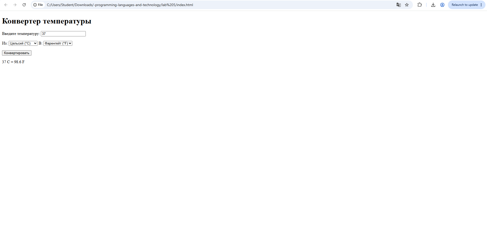
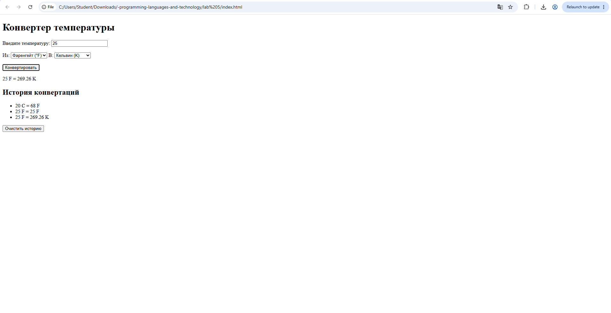

1. Цель работы
Освоить основы JavaScript в браузере: объявление переменных, условные конструкции, циклы,
пользовательские функции и взаимодействие с DOM. Научиться получать данные из HTML-элементов,
изменять содержимое страницы и обрабатывать действия пользователя.
Тема: JavaScript и DOM. Конвертер температуры и циклов, создание пользовательских функций, работу с DOM и обработку событий пользователя. Научиться получать данные из HTML-элементов, выполнять.

2. Номер и условие варианта
7 вариант средний 
Конвертер температуры:
Celsius/Fahrenheit/Kelvin с
функциями преобразования и
выводом результата.

3. Краткое описание алгоритма
Алгоритм работы программы:

Пользователь вводит значение температуры.

Пользователь выбирает исходную единицу измерения.

Пользователь выбирает единицу, в которую необходимо выполнить преобразование.

При нажатии кнопки программа получает значения из HTML-элементов с помощью DOM.

Проверяется, введено ли значение температуры.

Проверяется, не является ли температура ниже абсолютного нуля.

Исходное значение переводится в градусы Цельсия.

Значение из градусов Цельсия переводится в выбранную пользователем единицу.

Результат округляется до двух знаков после запятой.

Результат выводится на страницу.

Выполненная конвертация добавляется в историю.

Для преобразований используются функции toCelsius() и fromCelsius(). Основная логика программы находится в функции convertTemperature().

4. HTML-код

<!DOCTYPE html>
<html lang="ru">
<head>
    <meta charset="UTF-8">
    <title>Конвертер температуры</title>
</head>
<body>

    <h1>Конвертер температуры</h1>

    <label for="temperature">Введите температуру:</label>
    <input type="number" id="temperature" placeholder="Например, 25">

      

    <label for="fromUnit">Из:</label>
    <select id="fromUnit">
        <option value="C">Цельсий (°C)</option>
        <option value="F">Фаренгейт (°F)</option>
        <option value="K">Кельвин (K)</option>
    </select>

    <label for="toUnit">В:</label>
    <select id="toUnit">
        <option value="C">Цельсий (°C)</option>
        <option value="F">Фаренгейт (°F)</option>
        <option value="K">Кельвин (K)</option>
    </select>

      

    <button id="convertButton">Конвертировать</button>

    
Результат появится здесь

    <h2>История конвертаций</h2>

    <ul id="history"></ul>

    <button id="clearHistory">Очистить историю</button>

    
</body>
</html>

java script код 

const temperatureInput = document.querySelector("#temperature");
const fromUnit = document.querySelector("#fromUnit");
const toUnit = document.querySelector("#toUnit");
const convertButton = document.querySelector("#convertButton");
const result = document.querySelector("#result");
const history = document.querySelector("#history");
const clearHistory = document.querySelector("#clearHistory");

function toCelsius(value, unit) {
    if (unit === "C") {
        return value;
    } else if (unit === "F") {
        return (value - 32) * 5 / 9;
    } else if (unit === "K") {
        return value - 273.15;
    }
}

function fromCelsius(value, unit) {
    if (unit === "C") {
        return value;
    } else if (unit === "F") {
        return value * 9 / 5 + 32;
    } else if (unit === "K") {
        return value + 273.15;
    }
}

function convertTemperature() {
    const value = Number(temperatureInput.value);
    const from = fromUnit.value;
    const to = toUnit.value;

    if (temperatureInput.value === "") {
        result.textContent = "Введите температуру.";
        return;
    }

    if (from === "C" && value < -273.15) {
        result.textContent = "Ошибка: температура не может быть ниже -273.15 °C.";
        return;
    } else if (from === "F" && value < -459.67) {
        result.textContent = "Ошибка: температура не может быть ниже -459.67 °F.";
        return;
    } else if (from === "K" && value < 0) {
        result.textContent = "Ошибка: температура в Кельвинах не может быть ниже 0 K.";
        return;
    }

    const celsius = toCelsius(value, from);
    const convertedValue = fromCelsius(celsius, to);

    let roundedValue = convertedValue;

    for (let i = 0; i < 1; i++) {
        roundedValue = Math.round(convertedValue * 100) / 100;
    }

    result.textContent =
        value + " " + from + " = " + roundedValue + " " + to;
        const historyItem = document.createElement("li");
historyItem.textContent =
    value + " " + from + " = " + roundedValue + " " + to;

history.appendChild(historyItem);

}

convertButton.addEventListener("click", convertTemperature);

temperatureInput.addEventListener("input", function () {
    result.textContent = "Введите данные и нажмите «Конвертировать».";
});

fromUnit.addEventListener("change", function () {
    result.textContent = "Единица температуры изменена.";
});
clearHistory.addEventListener("click", function () {
    history.innerHTML = "";
});

5. скриншоты

доп задание

6. Тестовые сценарии
Сценарий 1 — преобразование Цельсия в Фаренгейт
Входные данные:

Температура: 25

Из: Цельсий

В: Фаренгейт

Ожидаемый результат:

25 C = 77 F

Результат: программа корректно выполнила преобразование.

Сценарий 2 — преобразование Кельвина в Цельсий
Входные данные:

Температура: 300

Из: Кельвин

В: Цельсий

Ожидаемый результат:

300 K = 26.85 C

Результат: программа корректно выполнила преобразование.

Сценарий 3 — проверка некорректного значения
Входные данные:

Температура: -500

Из: Цельсий

В: Фаренгейт

Ожидаемый результат:

Ошибка: температура не может быть ниже -273.15 °C.

8. Описание дополнительной функции
В качестве дополнительной функции была реализована история конвертаций.

После каждого успешного преобразования результат автоматически добавляется в список на странице. Для создания элементов списка используется метод document.createElement(), а для добавления элемента на страницу — appendChild().

Также реализована кнопка «Очистить историю», которая удаляет все сохранённые результаты.

Данная функция решает проблему пользователя, которому необходимо выполнить несколько преобразований и сравнить полученные результаты. Благодаря истории не требуется повторно выполнять предыдущие расчёты.

9. Вывод
В ходе лабораторной работы был разработан веб-конвертер температуры на JavaScript. Программа позволяет преобразовывать значения между градусами Цельсия, Фаренгейта и Кельвина.

В процессе выполнения работы были использованы переменные let и const, условные конструкции if/else, цикл for, пользовательские функции, методы DOM и обработчики событий click, input и change.

Также была реализована дополнительная функция — история выполненных конвертаций с возможностью её очистки.

В результате работы были получены практические навыки создания интерактивных веб-страниц и взаимодействия JavaScript с HTML-элементами через DOM.